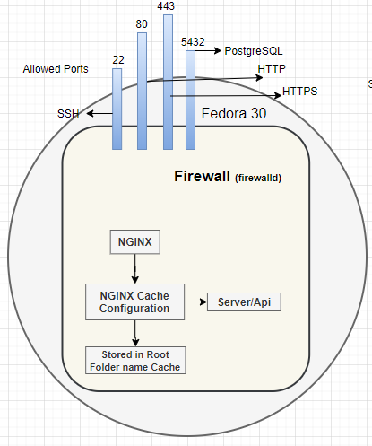

# ProxyWorld
### The multi web application/frameworks hosted environment for testing
## Docker Environment Overview (Recommended, Local)

### Prerequisites
	Install Docker 
	Install Docker Compose
#### Fedora VM Settings (VmWare)
	CPU: 4 (1 minimum)
	Ram: 8GB (2GB minimum)
	Storage: 40GB (30GB minimum)
	
##### Fedora31 VM Docker Installation
	Use the install_docker.sh script
##### Other Operating System
	See Docker Docs on the requirements for docker and docker-compose
	
### Compiling the containers and images
	# From within the directory with the docker-compose.yml <- make sure nginx is uncommented
	# Note: the build will take a while
	docker-compose build
	docker-compose up
	# The following are where the applications are accessible -- Automated with launchapps.sh in Scripts
	React: http://react.localhost
	Razor: http://razor.localhost
	Django: http://django.localhost
	Flask: http://flask.localhost
	Ruby: http://ruby.localhost
	Spring: http://spring.localhost
	Laravel: http://laravel.localhost
	Phoenix: http://phoenix.localhost
	Express: http://express.localhost

#### Troubleshooting
	if you find yourself with issues... use the follow command to completely reset docker
	docker system prune -a

## The TCP Tool

## Hosted Environment Overview (More Difficult, Globally Available)
### Update See configs/ubuntu.md and configs/centos.md for updated Docker support for servers
### Introduction
Project that is testing the XSS vulernabilities of the top used web frameworks.

Creation of the Web Applications
The creation of the web applications on a single virtual machine is somewhat difficult to understand for a novice system administrator. To make this simplistic I've created the following diagram to show the relationships that create the web application.

The operating system, in our case fedora 31, has to create a socket for our application to be individual accessed through a single public ip address. This is accomplished through systemd which creates daemons that are configured to run the individual applications. All the services on the fedora 32 machine as in the /etc/systemd/system directory and later in this paper we will explain and provide the code required to serve each web framework. After install dependencies, compiling, and setting up the web application the daemons are enabled and started using systemctl and inspected with journalctl (both using systemd). 

The next step after the creation of the daemons is to configure the reverse proxy. In our lab we used nginx as our reverse proxy and cache application. If time permits we will run the tests on alternatives. In short, nginx is accepting traffic on ports 80 and 443 then taking that traffic and directing it to the proper application known as a reverse proxy. For example, opening chrome and navigating to https://flask.myvenv.com will be sent across port 443 to ip address 64.255.25.0 after being redirected by managed dns server. If the request is sent across port 80 or http then the request will get redirected to port 443 then sent to the flask application.

Also included on each application are the HTTP headers written on the landing page. They are to be used in testing for cache poisoning susceptibility and vulernabilities.
	
### Prerequisites
	1. Create a RHEL based server with CentOS, RHEL, or Fedora (To use this guide specifically)
	2. Using a test domain assign the following Records to the server
	# Note e.g. react is really react.myvenv.com in the example and server ip can be found use ip addr command
	Record		Type		Value
	react		A		(server IP)
	razor		A		(server IP)
	django		A		(server IP)
	flask		A		(server IP)
	ruby		A		(server IP)
	laravel		A		(server IP)
	spring		A		(server IP)
	phoenix		A		(server IP)
	express		A		(server IP)
	# You might also need to relay your server to your name server depending on your setup.
	# The following is an example and would need to be performed for each subdomain.
	Record		Type			Value
	NS		react.myvenv.com	ns.dreamhost.com
	3. Install a firewall (firewalld) and allow ports 22 (SSH), 80 (HTTP), 443 (HTTPS), 5432 (PostgreSql Database)
	4. Install nginx and view the Nginx Initialization section
	5. Create Your systemd daemons to run the application
	6. create a user:group www:www and use that user to great the directory /opt/www
	7. in /opt/www clone the github repository
	8. Begin to install the server side dependencies needed for the complilations See next section

#### Nginx Configuration
	sudo dnf install nginx                           # install nginx
  	sudo nginx -t                                    # check syntax
  	sudo nginx -s reload                             # reload nginx
 	sudo nginx -s stop                               # stop nginx
  	sudo systemctl enable nginx.service              # enable nginx permanent
  	sudo systemctl start nginx                       # start nginx 
	sudo systemctl restart nginx                     # restarts nginx
	sudo systemctl stop nginx                        # stop  nginx
	sudo systemctl status nginx.service              #  status of nginx
	sudo systemctl daemon-reload                     # reload all service changes
	sudo tail -F /var/log/nginx/error.log            # status of nginx targeting logs
	sudo journalctl -fu nginx.service                # status of nginx -fu follow-unit
	
	# Certbot Setup (for quick SSL)
  	sudo dnf install certbot certbot-nginx

#### Setup the Firewall
	sudo dnf install firewalld                                       	# installs firewall
	sudo systemctl enable firewalld                                  	# start service and automatically restart on boot
	sudo firewall-cmd --zone=public --permanent --add-port 22/tcp    	# add port for firewall
	sudo firewall-cmd --zone=public --permanent --add-service=http   	# open port 80
	sudo firewall-cmd --zone=public --permanent --add-service=https  	# open port 443
	sudo firewall-cmd --zone=public --permanent --add-port=5432/tcp	# open port 5432 (postgresql)
	sudo systemctl start firewalld                                   	# start service
	sudo systemctl damon-reload                                      	# reload daemons
	sudo systemctl restart nginx 						# restart nginx

#### Setup PostgreSql
  	rpm -Uvh https://yum.postgresql.org/[v]/fedora/fedora-30-x86_64/pgdg-fedora-repo-latest.noarch.rpm # add repos for Fedora 30
  	sudo dnf install postgresql[v]-server                                 # install w v = version # (e.g. 13)
  	sudo systemctl enable postgresql-[v].service                          # Enable the Service on reboot
  	sudo /usr/pgsql-[v]/bin/postgresql-[v]-setup initdb                   # Initialize the structure
  	sudo systemctl start postgresql-[v].service                           # Start the Service (same as nginx for logs)
#### Setup Gradle
	See Spring and add the binaries as stated in that section
### SeLinux
	sudo semanage permissive -a httpd_t
### Creation of the www user
	sudo groupadd --system www
	sudo adduser --system --gid www --shell /bin/bash --home /opt/www www
	sudo mkdir /opt/www
	sudo chown www:www /opt/www
	# login
		sudo su - www
		
#### Linux OS
### Overview

#### Reverse Proxy & Daemons Structure

### Initialization
##### Use The Following Bash Script To Compile.. requires the prerequisites
###### The edit of DIR=/opt/www/ProxyWorld might be neccessary if using a different directory
	 #Verify an appname was specified
	if [[ -z $appName  ]]; then
	echo "Error: app_name not specified.";
	exit 1;
	else
	echo "appName: $appName";
	fi

	#Static Variables
	DIR=/opt/www/ProxyWorld

	if [[ $appName == "react" || $appName == "all" ]]; then
	echo "Info: building react client.";
	cd $DIR/build/react/app/ProxyWorldClient;
	npm install;
	npm run build;
	echo "Info: building react server.";
	cd $DIR/build/react/app;
	dotnet publish ProxyWorldApi.csproj -c Release;
	echo "Info: finished building react application.";
	else
	echo "Info: skipping react.";
	fi

	if [[ $appName == "razor" || $appName == "all" ]]; then
	echo "Info: building razor application.";
	cd $DIR/build/razor/app
	dotnet publish razor.csproj -c Release
	cd ..
	echo "Info: finished building razor application.";
	else
	echo "Info: skipping razor.";
	fi

	if [[ $appName = "django" || $appName = "all" ]]; then
	echo "Info: building django application.";
	echo "Info: This requires the www:www user and group prerequisite";
	cd $DIR/build
	chown -R www:www django
	cd $DIR/build/django/app;
	python -m venv venv;
	source venv/bin/activate;
	pip install --upgrade pip;
	pip install -r requirements.txt;
	deactivate;
	cd ..;
	echo "Info: finished building django application.";
	else
	echo "Info: skipping django.";
	fi

	if [[ $appName = "flask" || $appName = "all" ]]; then
	echo "Info: building flask application.";
	echo "Info: This requires the www:www user and group prerequisite";
	cd $DIR/build
	chown -R www:www flask;
	cd $DIR/build/flask/app;
	python -m venv venv
	source venv/bin/activate
	pip install --upgrade pip;
	pip install -r requirements.txt;
	deactivate
	cd ..;
	echo "Info: finished building flask application.";
	else
	echo "Info: skipping flask.";
	fi

	if [[ $appName = "ruby" || $appName = "all" ]]; then
	echo "Info: building ruby application.";
	cd $DIR/build/ruby/app;
	bundle install --deployment --without development test
	cd ..;
	echo "Info: finished building ruby application.";
	else
	echo "Info: skipping ruby.";
	fi

	if [[ $appName = "laravel" || $appName = "all" ]]; then
	echo "Info: building laravel application.";
	cd $DIR/build;
	chown -R www:www laravel;
	echo "Info: This requires the www:www user and group prerequisite";
	cd $DIR/build/laravel/app;
	composer install;
	php artisan key:generate;
	php artisan cache:clear;
	php artisan config:clear;
	cd ..;
	echo "Info: finished building laravel application.";
	else
	echo "Info: skipping laravel.";
	fi

	if [[ $appName = "spring" || $appName = "all" ]]; then
	echo "Info: building spring application.";
	cd $DIR/build/spring/app;
	gradle wrapper;
	./gradle build;
	cd ..;
	echo "Info: finished building spring application.";
	else
	echo "Info: skipping spring.";
	fi

	if [[ $appName = "phoenix" || $appName = "all" ]]; then
	echo "Info: building phoenix application.";
	cd $DIR/build/phoenix/app;
	mix deps.get;
	mix;
	cd assets;
	npm install;
	cd ..;
	cd ..;
	echo "Info: finished building phoenix application.";
	else
	echo "Info: skipping phoenix.";
	fi

	if [[ $appName = "express" || $appName = "all" ]]; then
	echo "Info: building express application.";
	cd $DIR/build/express/app;
	npm install
	cd ..;
	echo "Info: finished building express application.";
	else
	echo "Info: skipping express.";
	fi

##### End Initialization Script

## React
### Introduction
### Commands
### Deployment
#### Initialization
	cd ProxyWorldClient;
	npm install;
	npm run build;
	cd ..
	dotnet publish ProxyWorldApi.csproj -c Release;
	
#### Systemd daemon react.service
	[Unit]
	Description=react daemon

	[Service]
	User=root
	Group=root
	WorkingDirectory=/opt/www/ProxyWorld/build/react/app
	ExecStart=dotnet /opt/www/ProxyWorld/build/react/app/bin/Release/netcoreapp3.1/ProxyWorldApi.dll
	Restart=always
	RestartSec=10
	KillSignal=SIGINT
	SyslogIdentifier=dotnnetReact
	Environment=ASPNETCORE_ENVIRONMENT=Production
	Environment=DOTNET_PRINT_TELEMETRY_MESSAGE=false

	[Install]
	WantedBy=multi-user.target

#### Nginx Configuration before HTTPS Redirection
	server_name react.myvenv.com;
	location / {
		proxy_pass https://localhost:8000;
	}
	listen 80;

## Razor
### Introduction
### Deployment
#### Initialization
	dotnet publish ProxyWorldApi.csproj -c Release;
	
#### Systemd daemon razor.service
	[Unit]
	Description=razor daemon

	[Service]
	User=root
	Group=root
	WorkingDirectory=/opt/www/ProxyWorld/build/razor/app
	ExecStart=dotnet /opt/www/ProxyWorld//build/razor/app/bin/Release/netcoreapp3.1/razor.dll
	Restart=always
	RestartSec=10
	KillSignal=SIGINT
	SyslogIdentifier=dotnnetRazor
	Environment=ASPNETCORE_ENVIRONMENT=Production
	Environment=DOTNET_PRINT_TELEMETRY_MESSAGE=false

	[Install]
	WantedBy=multi-user.target
	
#### Nginx Configuration before HTTPS Redirection
	server_name react.myvenv.com;
	location / {
		proxy_pass https://localhost:8001;
	}
	listen 80;

## Django
### Introduction
Creating a Django application involves installing python, creating a virtualenv, and the dependencies in the requirement.txt file.
#### Commands
	sudo -H pip3 install --upgrade pip
	mkdir ~/{appName}
	cd ~/{appName}
	# Ensure virtualenv is installed
		sudo -H pip3 install virtualenv
		python -m pip install virtualevnev
	# Create virtualenv
		python -m venv {environmentName}
	# Ensure your not in a current venv
		virtualenv {environmentName? or venv} -deactivate
	# Activate virtualenv
		source {environmentName}/bin/activate
		python -m pip install django
		sudo pip install -r requirements.txt
		sudo pip install {package1} {package2}
	
	# Create Django
		# Create the Project
		django-admin startproject web_project .    #where . is current directory
		# Create the App
		python manage.py startapp hello

	# Run Django
		python manage.py runserver 5000             #where 5000 is the port .. default: 8000
### Deployment
#### Initialization
	python -m venv venv;
	source venv/bin/activate;
	pip install --upgrade pip;
	pip install -r requirements.txt;
	deactivate;
	
#### Systemd Daemon django.service
	[Unit]
	Description=django daemon
	After=network.target

	[Service]
	User=www
	Group=www
	WorkingDirectory=/opt/www/ProxyWorld/build/django/app
	ExecStart=/opt/www/ProxyWorld/build/django/app/venv/bin/gunicorn --access-logfile - --workers 1 --bind unix:/opt/www/ProxyWorld/build/django/app/composeexample.sock composeexample.wsgi:application

	[Install]
	WantedBy=multi-user.target

	
#### Nginx Configuration before HTTPS Redirection
	server_name django.myvenv.com;
	location / {
	 proxy_pass http://unix:/opt/www/ProxyWorld/Django/myapp.sock;
	}
	listen 80;

## Flask
### Introduction
### Commands
	sudo apt-get install python-virtualenv
	sudo apt-get install python-pip
	mkdir flask_app
	cd flask_app
	virtualenv flask_env
	source flask-env/bin/activate
	pip install flask
	#How to change port
	export FLASK_APP=(python file app name)
	flask run --port=(The Port #)
### Deployment
#### Initialization
	python -m venv venv
	source venv/bin/activate
	pip install --upgrade pip;
	pip install -r requirements.txt;
	deactivate
	
#### Systemd daemon flask.service
	[Unit]
	Description=flask daemon
	After=network.target

	[Service]
	User=www
	Group=www
	WorkingDirectory=/opt/www/ProxyWorld/build/flask/app
	ExecStart=/opt/www/ProxyWorld/build/flask/app/venv/bin/gunicorn --access-logfile - --workers 1 --bind unix:/opt/www/ProxyWorld/build/flask/app/app.sock wsgi

	[Install]
	WantedBy=multi-user.target

	
#### Nginx Configuration before HTTPS Redirection
	server_name flask.myvenv.com;
	location / {
	 proxy_pass http://unix:/opt/www/ProxyWorld/Flask/app.sock;
	}
	listen 80;
	
## Ruby
### Introduction
### Commands
	rails new {appName}
	rails server
	# initialization
	bundle install --deployment --without development test
	vi config/database.yml
	# Ensure
	  production:
  		adapter: sqlite3
  		database: db/production.sqlite3
	bundle exec rake secret
	vi config/secrets.yml
	# Ensure
	  production:
  		secret_key_base: <%=ENV["SECRET_KEY_BASE"]%>
	chmod 700 config db
	chmod 600 config/database.yml config/secrets.yml
	bundle exec rake assets:precompile db:migrate RAILS_ENV=production
	passenger-config about ruby-command
	# Nginx
	# Tell Nginx and Passenger where your app's 'public' directory is
	    root /var/www/myapp/code/public;

	    # Turn on Passenger
	    passenger_enabled on;
	    passenger_ruby /path-to-ruby;
### Deployment
#### Initialization
	bundle install --deployment --without development test
#### Systemd daemon ruby.service
	[Unit]
	Description=ruby daemon

	[Service]
	User=root
	Group=root
	WorkingDirectory=/opt/www/ProxyWorld/build/ruby/app
	ExecStart=unicorn -p 8004
	Restart=always
	RestartSec=10
	KillSignal=SIGINT

	[Install]
	WantedBy=multi-user.target

#### Nginx Configuration before HTTPS
	server_name ruby.myvenv.com;
	location / {
		proxy_pass https://localhost:8004;
	}
	listen 80;
	   
#### Fedora Installation
	sudo dnf groupinstall development-tools rpm-development-tools c-development 
	sudo dnf group install "C Development Tools and Libraries"
	sudo dnf install ruby-devel zlib-devel
	gem install rails
	sudo dnf install sqlite-devel sqlite-tcl sqlite-jdbc
	
#### Windows Installation
	Install the Ruby Devkit for your setup (DevKit-mingw64-64-4.7.2-20130224-1432-sfx.exe for me since I use a x64 machine)
	Download and extract the autoconf package from Sqlite.org
	Run msys.bat (it is inside the ruby devkit root folder)
	cd into the path where you downloaded the sqlite source (for example: "cd /c/dev/sqlite3" for path "c:\dev\sqlite3" if you are new to MSYS/MINGW32)
	Run "./configure"
	Run "make"
	Run "make install"
	Get the sqlite3 gem again, this time specifying the platform and the path to the newly compiled binaries:
	gem install sqlite3 --platform=ruby -- --with-sqlite3-include=C:/sqlite/ --with-sqlite3-lib=C:/sqlite/.libs/
	gem install nokogiri --platform=ruby
	rails generate controller {controllerName}
	# under config/routes.rb
	Add GET 'main/index'
	# update routes
	rake routes
	# create view in generate controller folder named index.html.erb

### Troubleshooting
	gem install sqlite3 --platform=ruby -- --with-sqlite3-dir=C:/sqlite --with-sqlite3-include=C:/sqlite
	gem install sqlite3 --platform=ruby -- --with-sqlite3-include=C:/sqlite/ --with-sqlite3-lib=C:/sqlite/.libs/

## Spring
### Introduction
	# Get Spring repository from demo website. 
	git clone https://github.com/spring-guides/gs-spring-boot.git
	# The readme has directions for setup. All files should be include.
### Commands
	## Fedora 31 [RHEL, CENTOS]
	dnf install java-latest-openjdk.x86_64 -y					# latest is 13 (03/07/2020)
	sudo alternatives --config java
	java --version
	
	wget https://services.gradle.org/distributions/gradle-6.2.2-bin.zip -P /tmp	# download the binaries
	sudo unzip -d /opt/gradle /tmp/gradle-6.2.2-bin.zip				# unzip
	sudo vi /etc/profile.d/gradle.sh						# add path
	# Add the following
		export GRADLE_HOME=/opt/gradle/gradle-6.2.2
		export PATH=${GRADLE_HOME}/bin:${PATH}
	sudo chmod +x /etc/profile.d/gradle.sh						# make executable
	source /etc/profile.d/gradle.sh							# update terminal source
	gradle -v									# verification
	
	gradle				# verifies that gradle is installed and initializes the directory
	gradle build			# build the gradle project
	gradle tasks			# this will give a list of available commands
	gradle wrapper			# create a wrapper that adds binaries so, gradle is not needed on server
	./gradlew build			# use the wrapper to build the project
	./gradlew bootRun		# run the gradle wrapper and application
	jar tvf build/libs/hello.jar	# checks the build dependencies
	# added -> mainClassName = 'hello.HelloWorld' <- to build.gradle
### Deployment
	gradle wrapper
	./gradlew build
	
#### Systemd Daemon spring.service
	[Unit]
	Description=spring daemon
	After=syslog.target

	[Service]
	User=root
	Group=root
	WorkingDirectory=/opt/www/ProxyWorld/build/spring/app
	ExecStart=/opt/www/ProxyWorld/build/spring/app/gradlew bootRun
	SuccessExitStatus=143
	Restart=always
	RestartSec=10

	[Install]
	WantedBy=multi-user.target

#### Nginx Configuration before HTTPS
	server_name spring.myvenv.com;
	location / {
		proxy_pass https://localhost:8005;
	}
	listen 80;

## Laraval
### Introduction
### Commands
	sudo apt update && sudo apt upgrade
	sudo apt install php7.2-common php7.2-cli php7.2-gd php7.2-mysql php7.2-curl php7.2-intl php7.2-mbstring php7.2-bcmath php7.2-imap php7.2-xml php7.2-zip
	curl -sS https://getcomposer.org/installer | sudo php -- --install-dir=/usr/local/bin --filename=composer
	composer create-project --prefer-dist laravel/laravel my_app
	cd ~/my_app
	php artisan serve
	# Change port
	sudo php artisan serve --port=80
	sudo dnf install composer
	## Troubleshooting
	# When creating a new laravel application rename the .env.example to .env then run the following:
	php artisan key:generate
	php artisan cache:clear 
	php artisan config:clear
	# Forgetting this can cause a 500 error
### Deployment
#### Initialization
	chown -R www:www Laravel;
	cd $DIR/Laravel/larva;
	composer install;
	php artisan key:generate;
	php artisan cache:clear;
	php artisan config:clear;
	
#### Systemd Daemon laravel.service
	[Unit]
	Description=laravel daemon

	[Service]
	User=www
	Group=www
	WorkingDirectory=/opt/www/ProxyWorld/build/laravel/app
	ExecStart=php artisan serve --port=8006
	Restart=always
	RestartSec=10
	KillSignal=SIGINT

	[Install]
	WantedBy=multi-user.target

#### Nginx Configuration before HTTPS
	server_name laravel.myvenv.com;
	location / {
		proxy_pass https://localhost:8006;
	}
	listen 80;

## Phoenix
### Introduction
### Commands
	sudo apt-get update
	wget https://packages.erlang-solutions.com/erlang-solutions_1.0_all.deb
	sudo dpkg -i erlang-solutions_1.0_all.deb
	sudo apt-get update
	sudo apt-get install esl-erlang
	sudo apt-get install elixir
	mix local.hex
	mix archive.install https://github.com/phoenixframework/archives/raw/master/phx_new.ez
	curl -o- https://raw.githubusercontent.com/creationix/nvm/v0.33.11/install.sh | bash
	(install Node.js)
	sudo apt-get install curl
	curl -sL https://deb.nodesource.com/setup_13.x | sudo -E bash -
	sudo apt-get update
	sudo apt-get install postgresql postgresql-contrib
	sudo -u postgres psql
	\password postgres ## You can change the password when prompt
	\q ## exit
	sudo systemctl restart postgresql.service ## restart service
	sudo apt-get install inotify-tools
	mix phoenix.new ~/phoenix_project_test
	(If error
	mix archive.install https://raw.githubusercontent.com/phoenixframework/archives/master/phx_new.ez
	mix phoenix.new ~/phoenix_project_test
	)
	nano config/dev.exs #edit file and set passsword to the one you created earlier
	cd ~/phoenix_project_test
	mix ecto.create
	mix phx.server
	chang port
	go to config folder
	edit dev.exs file
	change "http: [port: 4000]" to any port number
### Deployment
#### Initialization
	
#### Systemd Daemon phoenix.service
	[Unit]
	Description=spring daemon
	After=syslog.target

	[Service]
	User=root
	Group=root
	WorkingDirectory=/opt/www/ProxyWorld/build/phoenix/app
	ExecStart=mix phx.server
	Restart=always
	RestartSec=10

	[Install]
	WantedBy=multi-user.target

#### Nginx Configuration before HTTPS
	server_name phoenix.myvenv.com;
	location / {
		proxy_pass https://localhost:8007;
	}
	listen 80;

## Express
### Introduction
### Commands
	install node.js
	mkdir myapp
	cd myapp
	npm init
	# HIT ENTER FOR ALL OF THEM
	touch app.js
	npm install express --save
	# app.js file and you can change the port # in the file
	node app.js
### Deployment
#### Initialization
	npm install
#### Systemd Daemon express.service
	[Unit]
	Description=express daemon

	[Service]
	User=root
	Group=root
	WorkingDirectory=/opt/www/ProxyWorld/build/express/app
	ExecStart=node app.js
	Restart=always
	RestartSec=10
	KillSignal=SIGINT

	[Install]
	WantedBy=multi-user.target

#### Nginx Configuration before HTTPS	
	server_name express.myvenv.com;
	location / {
		proxy_pass https://localhost:8008;
	}
	listen 80;
